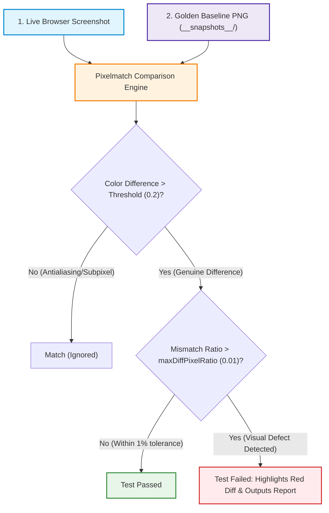

# Playwright Native Visual Regression Testing Guide

---

## 1. Executive Summary (For Non-Technical Stakeholders & Product Owners)

### What is Visual Regression Testing?
When developers update website code or add new features, small changes can accidentally break the visual design—such as buttons shifting out of place, text turning the wrong color, or forms overlapping.

**Visual Regression Testing** acts like an automated quality inspector with a camera:
1. **The Reference Photo ("Golden Baseline"):** On the first test run, Playwright takes a pristine picture of the page or widget and saves it in the project.
2. **The Verification Check:** During every subsequent run (or pull request), Playwright takes a fresh picture and compares it pixel-by-pixel against the reference.
3. **The Result:** 
   * If the page looks identical, the test **passes**.
   * If an unintended visual change occurred, the test **fails immediately** and generates a report highlighting every changed pixel in bright red, along with an interactive side-by-side slider.

```
┌─────────────────────────┐      ┌─────────────────────────┐      ┌─────────────────────────┐
│        EXPECTED         │  vs  │         ACTUAL          │  =>  │        DIFF (RED)       │
│    (Golden Baseline)    │      │    (Live Screen Run)    │      │  (Highlighted Mismatch) │
│                         │      │                         │      │                         │
│   [ BLUECHEW ]          │      │   [ BLUECHEW ]          │      │   [ BLUECHEW ]          │
│   Welcome back!         │      │   Welcome back!         │      │   Welcome back!         │
│   [ CONTINUE ] (Grey)   │      │   [ BUY NOW  ] (Pink)   │      │   [ ████████ ] (RED)    │
└─────────────────────────┘      └─────────────────────────┘      └─────────────────────────┘
```

---

## 2. Why Native Playwright vs. Applitools (Cost & Reliability Comparison)

| Comparison Factor | Applitools Eyes | Playwright Native (`toHaveScreenshot`) |
| :--- | :--- | :--- |
| **Licensing & Cost** | Expensive recurring subscription / per-snapshot fee | **100% Free & Open-Source** (Included in Playwright) |
| **Third-Party Dependency** | Requires external cloud connectivity & API keys | **Zero External Dependencies** (Runs completely local & in CI) |
| **API Key Issues** | Fails tests on invalid or expired keys (`InvalidApiKeyError`) | **Never Fails on Network/Auth** |
| **Baseline Storage** | Stored on vendor's cloud server | **Stored directly in Git repository** (`__snapshots__/`) |
| **Review & Approvals** | Vendor web portal dashboard | **Pull Request Reviews & Git Diffs** |
| **Updating Baselines** | Login to cloud web UI | **Single terminal command:** `--update-snapshots` |
| **Execution Speed** | Slower (Uploads full DOM/images to external cloud) | **Extremely Fast** (Local pixel comparison in ~100-300ms) |

---

## 3. How the Engine Works: The Pixelmatch Algorithm

Under the hood, Playwright uses **Pixelmatch**—a high-performance, perceptual pixel-diffing engine.



### Core Algorithmic Principles:
1. **YIQ Perceptual Color Space:** Pixelmatch converts RGB colors into the YIQ color space (Luminance + In-phase + Quadrature). This ensures that subtle differences human eyes cannot detect (like subpixel font smoothing across different OS monitors) are treated leniently, while real visual bugs (wrong button color, moved text) are flagged instantly.
2. **Antialiasing Detection:** Text on screens uses soft blurred pixels around edges ("antialiasing"). Pixelmatch intelligently distinguishes antialiased font edges from actual layout defects, preventing false alarms.
3. **Threshold Parameter (`threshold: 0.2`):** Defines the color difference sensitivity (from `0.0` for ultra-strict to `1.0` for very loose). `0.2` is the industry standard for web applications.
4. **Tolerance Limit (`maxDiffPixelRatio: 0.01`):** Allows up to 1% of total pixels to shift before failing, accommodating minor rendering quirks between GPU drivers while catching real bugs.

---

## 4. Playwright Visual Functions & Complete Parameter Reference

Playwright offers three visual assertion methods depending on the scope of testing:

### 4.1. `expect(page).toHaveScreenshot([name], [options])`
Captures the entire page (or full viewport) and compares it against the golden baseline.

#### Available Options & Parameters:

| Option | Type | Default | Description |
| :--- | :--- | :--- | :--- |
| `name` | `string` or `string[]` | Auto-generated | The snapshot file name (e.g. `'01-login-page-initial-full.png'`). |
| `fullPage` | `boolean` | `true` | When `true`, takes a screenshot of the entire scrollable webpage, not just the visible viewport. |
| `mask` | `Locator[]` | `[]` | Array of element locators to cover with a neutral overlay box (used for dynamic user emails, timers, or random IDs). |
| `maskColor` | `string` | `'#FF00FF'` (Pink) | Custom background color for masked elements. |
| `maxDiffPixelRatio` | `number` (0 to 1) | `0.01` (1%) | Maximum acceptable ratio of mismatched pixels to total pixels before triggering failure. |
| `maxDiffPixels` | `number` | `undefined` | Maximum absolute count of mismatched pixels allowed. |
| `threshold` | `number` (0 to 1) | `0.2` | Perceptual color difference threshold for pixelmatch. |
| `animations` | `'disabled'` \| `'allow'` | `'disabled'` | When `'disabled'`, stops CSS transitions, CSS keyframe animations, and GIF playback before taking the photo. |
| `caret` | `'hide'` \| `'initial'` | `'hide'` | Hides the blinking text cursor in form inputs to prevent timing-based diffs. |
| `scale` | `'css'` \| `'device'` | `'css'` | `'css'` scales images to device-independent CSS pixels (consistent across High-DPI / Retina displays). |
| `stylePath` | `string` | `undefined` | Path to a custom stylesheet (`visual-snapshot.css`) injected during capture to hide spinners and overlays. |
| `clip` | `{ x, y, width, height }` | `undefined` | Clips the screenshot to a specific rectangle coordinate. |
| `omitBackground` | `boolean` | `false` | Hides default white/black background allowing transparent image capture. |
| `timeout` | `number` | `15000` (15s) | Maximum time in ms to wait for the screenshot to match the baseline. |

---

### 4.2. `expect(locator).toHaveScreenshot([name], [options])`
Captures only a **specific component/widget** (e.g. login card, pricing comparison card, modal popup, order summary box).

```typescript
// Example: Capturing only the central login form card
const loginCard = page.locator("//div[@data-test-id='sign-in-page']");
await expect(loginCard).toHaveScreenshot('02-login-card-component.png', {
  maxDiffPixelRatio: 0.01,
  animations: 'disabled',
});
```

#### Why use Component Snapshots?
* **Zero Noise:** If marketing updates a global promo banner or header text, full-page tests will fail, but component tests stay green because the widget itself remains intact.
* **Speed:** Capturing a 400x300px box takes ~50ms vs. ~1-2 seconds for full 8,000px landing pages.

---

### 4.3. `expect(value).toMatchSnapshot(snapshotName)`
Used for comparing non-image text data (e.g. API JSON responses, DOM text structure).

```typescript
// Example: Verifying plan titles and terms text matches baseline text file
const faqText = await page.textContent('.faq-section');
expect(faqText).toMatchSnapshot('faq-content.txt');
```

---

## 5. Anti-Flakiness Strategy (`src/styles/visual-snapshot.css`)

To prevent flaky failures from animated web elements, Playwright automatically injects [`src/styles/visual-snapshot.css`](file:///c:/Users/BrainNotFound/Documents/GitHub/blueChew-automation/src/styles/visual-snapshot.css) during every snapshot:

```css
/* 1. Neutralize all animations & transitions globally */
*, *::before, *::after {
  animation-duration: 0s !important;
  animation-delay: 0s !important;
  transition-duration: 0s !important;
  scroll-behavior: auto !important;
}

/* 2. Freeze site-specific CSS classes */
.fadeIn, .fadeOut, .slideUp, .slideUp-25, .slideUp-70, .rotate-180 {
  animation: none !important;
  transition: none !important;
  opacity: 1 !important;
  visibility: visible !important;
}

/* 3. Hide loading spinners, SVG spinners, and progress overlays */
#app-loading, .ds-loader, app-loader, .loading-spinner, .processing-loader {
  visibility: hidden !important;
  opacity: 0 !important;
}

/* 4. Hide third-party live chat widgets */
html .woot--bubble-holder, html .woot-widget-bubble, #woot-widget {
  display: none !important;
}

/* 5. Hide blinking text carets */
input, textarea, select, .form-control {
  caret-color: transparent !important;
}
```

---

## 6. Project Architecture & Snapshot Directory Structure

Golden baselines are organized by test file and viewport project under [`__snapshots__/`](file:///c:/Users/BrainNotFound/Documents/GitHub/blueChew-automation/__snapshots__/):

```
blueChew-automation/
├── src/
│   ├── styles/
│   │   └── visual-snapshot.css             # Injected anti-flakiness stylesheet
│   ├── utilities/
│   │   └── visual.helper.ts                # Unified captureSnapshot & captureElementSnapshot wrapper
│   ├── page/
│   │   └── login/
│   │       └── login.page.ts               # Page Object with visual checkpoint methods
│   └── specs/
│       └── login/
│           └── login-visual.spec.ts        # Visual regression test suite
│
└── __snapshots__/
    └── src/specs/login/login-visual.spec.ts/
        ├── chromium-desktop/               # 1440x900 Desktop Baselines
        │   ├── 01-login-page-initial-full.png
        │   ├── 02-login-card-component.png
        │   ├── 03-login-validation-error-card.png
        │   └── 04-account-dashboard-landing.png
        │
        └── chromium-mobile/                # 393x852 Mobile Viewport Baselines
            ├── 01-login-page-initial-full.png
            ├── 02-login-card-component.png
            ├── 03-login-validation-error-card.png
            └── 04-account-dashboard-landing.png
```

---

## 7. Daily Workflow & CLI Commands

### 1. Run the Visual Regression Suite
Runs the live comparison against existing golden baselines in headed mode:
```powershell
npm run test:login:visual:playwright -- --headed
```

### 2. Update / Accept New Baselines
When design changes are intentional (e.g. approved rebranding or new layout):
```powershell
npm run test:login:visual:update -- --headed
```

### 3. Run the Visual Failure Demonstration
Simulates a visual bug to verify the diff detection engine:
```powershell
npm run test:login:visual:fail-demo -- --headed
```

### 4. View the Interactive HTML Report & Diffs
```powershell
npm run test:report
```
* **Expected:** Golden reference image.
* **Actual:** Live screenshot taken during the test.
* **Diff:** Red pixel overlay highlighting changed areas.
* **Slider:** Interactive before/after swipe bar.

---

## 8. Interactive Visual Diff Viewer & Slider (Deep-Dive)

### 8.1. What is the Interactive Diff Slider and What Does It Do?

When a visual regression assertion fails, the Playwright HTML Report (`npx playwright show-report` or `npm run test:report`) automatically embeds a rich **Interactive Image Diff Viewer**.

Rather than showing static, hard-to-read error logs or basic side-by-side pictures, the viewer provides QA, developers, and product managers with four interactive comparison modes directly in the browser:

```
┌─────────────────────────────────────────────────────────────────────────────┐
│  [ SLIDER ]          [ DIFF ]          [ ACTUAL ]          [ EXPECTED ]     │
├─────────────────────────────────────────────────────────────────────────────┤
│                                                                             │
│                    EXPECTED (Golden)  │  ACTUAL (Live Defect)               │
│                   ┌───────────────────│───────────────────┐                 │
│                   │   [ BLUECHEW ]    │   [ BLUECHEW ]    │                 │
│                   │   Welcome back!   │   Welcome back!   │                 │
│                   │   Email: [......] │   Email: [......] │                 │
│                   │   [ CONTINUE ]    │   [ CONTIN ](RED) │                 │
│                   └───────────────────│───────────────────┘                 │
│                                       ▲                                     │
│                              ◄──[ Drag Handle ]──►                          │
│                                                                             │
└─────────────────────────────────────────────────────────────────────────────┘
```

#### The 4 Interactive Modes:
1. **Slider Mode (Split-Screen Swipe):**
   - An interactive vertical split-bar handle that can be dragged left and right across the canvas.
   - Sliding reveals the **Expected baseline** on the left and the **Actual live screen** on the right in real time.
   - Perfect for pinpointing micro-shifts: 1px font size differences, padding changes, margin drift, and border-radius alterations.
2. **Diff Mode (Pixel Difference Heatmap):**
   - Renders the Pixelmatch diff image where all matching pixels are muted/grayed out and all **changed pixels are highlighted in luminous red (`#FF0000`)**.
   - Instantly answers: *"Where on the screen did the visual change occur?"*
3. **Actual Mode (Live Snapshot):**
   - Displays the un-altered screenshot captured directly from the live test execution.
4. **Expected Mode (Golden Reference):**
   - Displays the approved golden baseline stored in the repository (`__snapshots__/`).

---

### 8.2. How Exactly Did We Add & Configure It?

The interactive diff slider is generated seamlessly through a combination of our **`VisualHelper` architecture**, **native Playwright assertions**, and **artifact management**:

#### Step 1: Encapsulating Native Assertions in `VisualHelper`
In [`src/utilities/visual.helper.ts`](file:///c:/Users/BrainNotFound/Documents/GitHub/blueChew-automation/src/utilities/visual.helper.ts), we wrapped Playwright's `expect(page | locator).toHaveScreenshot()`:

```typescript
// For Component-Level Snapshots (e.g. login card, pricing card)
await expect(locator).toHaveScreenshot(sanitizedName, {
  mask: options.mask ?? [],
  maxDiffPixelRatio: options.maxDiffPixelRatio ?? 0.01,
  threshold: options.threshold ?? 0.2,
  animations: options.animations ?? 'disabled',
  stylePath: options.stylePath ?? this.defaultStylePath,
});
```

#### Step 2: Automatic Triplet Generation on Assertion Failure
When `toHaveScreenshot()` evaluates an image difference exceeding the configured tolerance (`maxDiffPixelRatio` / `threshold`), Playwright's test runner automatically generates and attaches three companion artifacts to the test execution directory (`test-results/<test-run-folder>/`):
1. `<snapshot-name>-expected.png` (Pulled from `__snapshots__/`)
2. `<snapshot-name>-actual.png` (Captured live during test execution)
3. `<snapshot-name>-diff.png` (Generated by the Pixelmatch color diff algorithm)

Playwright's built-in HTML reporter parses this artifact triplet and mounts the interactive slider canvas automatically.

#### Step 3: Eliminating Duplicate Screenshots (`test.use({ screenshot: 'off' })`)
By default, `playwright.config.ts` has `screenshot: 'only-on-failure'`, which captures a whole-page screenshot (`test-failed-1.png`) whenever any step fails. In visual regression tests, this creates a redundant full-page image alongside the visual diff.

To ensure **only the single visual comparison artifact and its interactive slider** appear in the report, we configure:

```typescript
// src/specs/login/login-visual.spec.ts
// Suppress global failure screenshots so only the visual checkpoint diff is retained
test.use({ screenshot: 'off' });
```

#### Step 4: Component Isolation for Ultra-Clear Diffs
Instead of taking full 10,000px page screenshots where small 10px button bugs get lost, [`captureElementSnapshot`](file:///c:/Users/BrainNotFound/Documents/GitHub/blueChew-automation/src/utilities/visual.helper.ts#L93) accepts either a `Locator` or a `LocatorInfo` object:

```typescript
// Captures only the targeted card container
await loginPage.captureLoginCardElementBaseline('02-login-card-component');
```
This isolates the slider canvas strictly to the component boundaries, making visual differences immediately obvious.

---

### 8.3. How to Open and Use the Slider

1. Run the visual regression test or failure demo:
   ```powershell
   npm run test:login:visual:fail-demo
   ```
2. Open the HTML report:
   ```powershell
   npm run test:report
   # or
   npx playwright show-report
   ```
3. Click on the failed visual test case (e.g. `LOG-VISUAL-FAIL-DEMO`).
4. Scroll down to the test step error (e.g. `[Visual] Capture Element Snapshot: "02-login-card-component.png"`).
5. Click on the **Slider** tab and drag the vertical slider handle left/right to inspect the UI regression.

