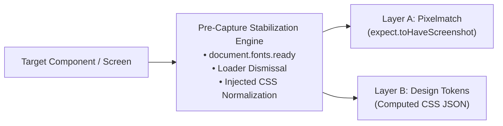

# Visual & Design System Verification Architecture

Technical reference and implementation documentation for automated visual regression and design system token validation within the Playwright automation framework.

---

## Executive Summary

Visual and design verification ensures user interface fidelity and brand token adherence across target viewports and browsers.

### Problem Context
Standard screenshot comparison tools frequently encounter test flakiness caused by asynchronous font rendering (FOIT/FOUT), network settling delays, CSS animations, and platform-specific antialiasing differences.

### 2-Layer Verification Architecture
The framework implements a native, multi-tiered visual and design verification strategy executing directly within Playwright:

```
┌────────────────────────────────────────────────────────────────────────┐
│                        2-LAYER VERIFICATION MATRIX                     │
├──────────────────────────────────┬─────────────────────────────────────┤
│ Layer A: Visual Pixelmatch       │ Layer B: Design System Tokens       │
│  (Pixel Camera)                  │     (Brand CSS Ruler)               │
├──────────────────────────────────┼─────────────────────────────────────┤
│ Captures actual rendered pixels  │ Validates exact computed CSS tokens │
│ (.png snapshots)                 │ (colors, fonts, radii) (.json)      │
└──────────────────────────────────┴─────────────────────────────────────┘
```

---

## Verification Layers



### Layer A: Macro & Component Pixelmatch (`.png`)
* **Scope**: Full-page layout capture and isolated component snapshotting.
* **Coverage**: Layout shifts, grid alignments, visual clipping, responsive breakpoint reflows, and cross-element overlaps.
* **Mechanism**: Built on Playwright native `expect(locator).toHaveScreenshot()` with dynamic masking and injected CSS stabilization.

### Layer B: Design System Computed Tokens (`.json`)
* **Scope**: Mathematical validation of computed CSS styles against version-controlled JSON baselines.
* **Coverage**: Brand typography (`font-family`, `font-size`, `font-weight`, `line-height`), palette colors (`color`, `background-color`, `border-color`), and geometry (`border-radius`, `box-shadow`, `padding`).
* **Mechanism**: Executes `window.getComputedStyle(el)` in browser context; evaluated via `expect(tokens).toMatchSnapshot('name.json')`.

---

## Implementation Reference: Authentication Module

### 1. Test Specification (`src/specs/login/login-visual.spec.ts`)
The test specification declares verification steps at the business level without exposing low-level assertion mechanisms:

```typescript
test('Visual Verification: Macro Pixelmatch & Computed Design Tokens',
  { tag: ['@visual', '@login', '@design-system'] },
  async ({ loginPage }) => {
    // 1. Navigate to target screen
    await loginPage.navigateToPage(scenario.loginPageDetails);

    // Layer A: Full-Page and Component Pixelmatch Snapshots
    await loginPage.captureFullPageInitialBaseline('login-page-fullscreen');
    await loginPage.captureLoginCardElementBaseline('login-card-isolated');

    // Layer B: Computed Design System Tokens (JSON Contract)
    await loginPage.assertLoginCardDesignTokens('login-card-tokens');
    await loginPage.assertLoginSubmitButtonDesignTokens('login-submit-button-tokens');

    // 2. Authenticate & Verify Post-Login State with Dynamic Masking
    await loginPage.loginWithCredentials(scenario.loginDetails);
    await loginPage.verifySuccessfulLogin();
    await loginPage.captureDashboardBaselineWithMasking('account-dashboard-masked');
  }
);
```

### 2. Page Object Model (`src/page/login/login.page.ts`)
Encapsulates element locators, stabilization routines, and verification delegates:

```typescript
// Layer A: Isolated component capture
async captureLoginCardElementBaseline(snapshotName: string = 'login-card-component'): Promise<void> {
  await test.step('Capture Isolated Login Card Component Baseline', async () => {
    await this.visual.captureElementSnapshot(this.locators.loginPageContainer, snapshotName, {
      maxDiffPixelRatio: 0.01,
    });
  });
}

// Layer B: Computed token assertion
async assertLoginCardDesignTokens(snapshotName: string = 'login-card-tokens'): Promise<Record<string, string>> {
  return await this.visual.assertDesignTokenSnapshot(this.locators.loginPageContainer, snapshotName);
}
```

### 3. Layer B Output Example (`login-submit-button-tokens.json`)
```json
{
  "color": "rgb(194, 194, 194)",
  "background-color": "rgb(97, 97, 97)",
  "font-family": "Roboto, sans-serif",
  "font-size": "16px",
  "font-weight": "400",
  "line-height": "24px",
  "letter-spacing": "normal",
  "border-radius": "40px",
  "border-top-width": "0px",
  "box-shadow": "none",
  "padding-top": "1px",
  "padding-bottom": "1px",
  "display": "flex",
  "opacity": "1"
}
```

---

## Architectural Advantages

| Advantage | Technical Implementation | Impact |
| :--- | :--- | :--- |
| **Deterministic Stability** | Automated pre-capture lifecycle awaiting `domcontentloaded`, `load`, `document.fonts.ready`, and spinner removal. | Eliminates false-positive test failures. |
| **Direct Root-Cause Identification** | Layer B JSON diff pinpointing exact CSS property shifts. | Pinpoints specific token defects immediately without manual visual triage. |
| **Zero Infrastructure Cost** | Native Playwright runner execution. | Eliminates recurring SaaS subscriptions and cloud transfer overhead. |
| **Fast Execution Lifecycle** | Local headless browser rendering (~20s execution). | Enables rapid feedback loops in local development and CI pipelines. |
| **Maintainable POM Architecture** | Verification logic isolated within Page Object classes. | Keeps test specs readable, declarative, and scalable. |

---

## Trade-offs and Mitigations

| Trade-off | Root Cause | Engineering Mitigation |
| :--- | :--- | :--- |
| **Cross-OS Subpixel Antialiasing** | Operating systems (Windows, macOS, Linux) render typography edges with different antialiasing algorithms. | CI baseline snapshots are generated in target Linux container environments. Stylesheet injection enforces `-webkit-font-smoothing: antialiased` with a standard 1% tolerance threshold (`maxDiffPixelRatio: 0.01`). |
| **Repository Storage Footprint** | Binary PNG snapshots stored in version control. | Snapshot strategy prioritizes isolated component-level captures (<20KB each) over full-page snapshots, keeping repository size minimal. |
| **Dynamic Content Variance** | Dynamic session emails, timestamps, and customer IDs change across runs. | Dynamic locators are masked using Playwright's `mask` property (`mask: [locators.userEmailDisplay]`). |

---

## Execution Reference

```bash
# Execute 2-Layer Visual Verification on Authentication Module
npm run test:visual:layers

# Update Snapshot Baselines (after intentional UI/Design changes)
npm run test:visual:layers:update

# Execute Complete Visual Regression Suite
npm run test:visual

# View HTML Test Results Report
npm run test:report
```
